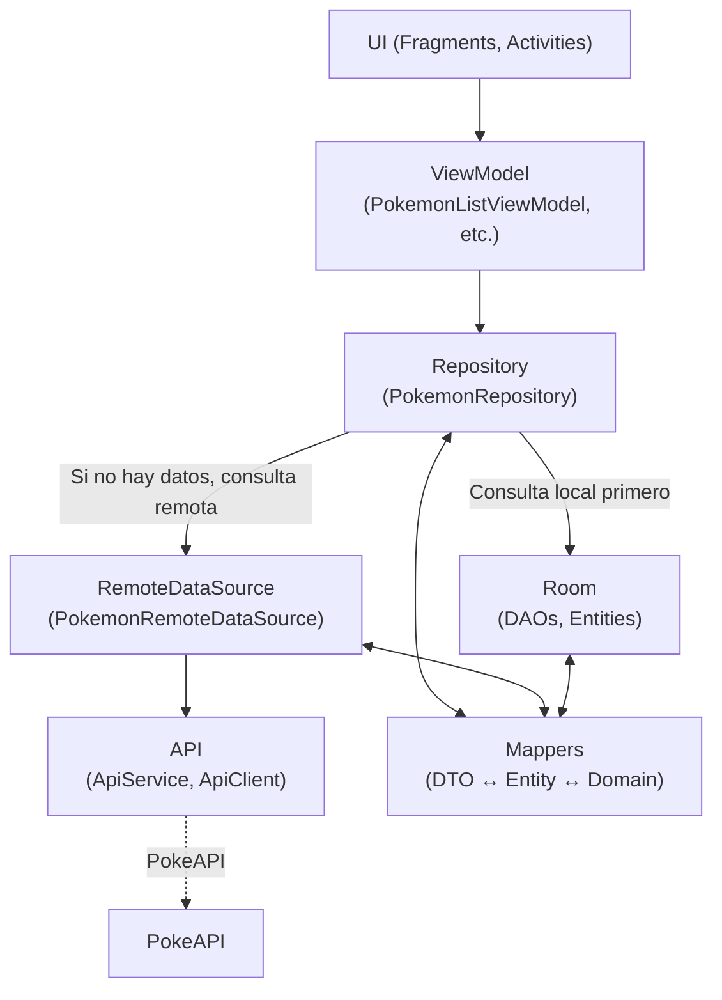

# CompletePokemonDex

<div align="center">
  
</div>

---

> **Proyecto para la asignatura _Informática Móvil_**
> _Grado en Ingeniería Informática en Tecnologías de la Información_
> **Universidad de Oviedo**

---

## 📱 ¿Qué es CompletePokemonDex?

**CompletePokemonDex** es una aplicación Android desarrollada en Kotlin que te permite explorar la Pokédex completa de la primera generación de Pokémon (Rojo y Azul), con una experiencia visual moderna, intuitiva y rica en detalles.

---

## ✨ Características principales

- **Lista de Pokémon**: Navega por todos los Pokémon de la primera generación, con búsqueda, filtrado por tipo y favoritos.
- **Detalles completos**: Consulta información detallada de cada Pokémon: estadísticas, tipos, movimientos, sprites y localizaciones.
- **Navegación fluida**: Interfaz basada en fragments y navegación inferior para acceder rápidamente a cada sección.
- **Detección offline**: Visualización de un overlay cuando no hay conexión a internet.
- **Inyección de dependencias con Hilt**: Arquitectura moderna y desacoplada.
- **Uso de caché**: Implementa caché mediante Room en todas las peticiones a la API, de manera que no se vuelva a realiza la misma petición 2 veces, ahorrando uso de datos.

---

## 🏗️ Arquitectura y estructura

El proyecto sigue una arquitectura limpia basada en **MVVM** (Model-View-ViewModel) y utiliza los siguientes componentes principales:

- **Fragments**: Cada sección de la app (lista, detalles, movimientos, localizaciones, etc.) es un fragmento independiente, lo que permite modularidad y navegación flexible.
- **ViewModels**: Gestionan el estado de la UI y la lógica de negocio, usando `LiveData` y `StateFlow` para exponer los datos de forma reactiva y desacoplada de la vista. Ejemplo: `PokemonListViewModel`, `PokemonMovesViewModel`, `PokemonLocationsViewModel`.
- **Repository**: El repositorio (`PokemonRepository`) centraliza el acceso a datos, implementando el patrón repositorio para abstraer las fuentes de datos (local y remota). Prioriza la obtención de datos desde la base de datos local (Room) y, en caso de no encontrarlos o estar desactualizados, consulta la API remota y almacena los resultados en la base de datos. Así, todas las peticiones implementan caché de manera transparente para la UI.
- **DAOs y Room**: Los DAOs gestionan el acceso a la base de datos local, permitiendo operaciones CRUD sobre entidades como Pokémon, detalles, especies, movimientos, tipos, habilidades, etc.
- **RemoteDataSource**: Encapsula el acceso a la API de PokeAPI, devolviendo DTOs que luego se mapean a entidades y modelos de dominio.
- **Mappers**: Se encargan de transformar los datos entre los distintos modelos (DTO ↔ Entity ↔ Domain), asegurando que la UI siempre trabaje con modelos de dominio limpios y desacoplados de la infraestructura.
- **Adapters**: Adaptadores para RecyclerView y chips de tipos, facilitando la visualización eficiente de listas y filtros.
- **Utilidades**: Clases utilitarias para tipos de Pokémon, localizaciones, colores, etc., centralizando la lógica común y la configuración visual.

### Ejemplo de flujo de datos

1. La UI solicita datos al ViewModel (por ejemplo, detalles de un Pokémon).
2. El ViewModel llama al método correspondiente del Repository.
3. El Repository primero consulta la base de datos local (Room) usando el DAO. Si los datos existen y son válidos, los mapea a modelos de dominio y los devuelve.
4. Si los datos no existen o están desactualizados, el Repository solicita los datos a la API remota (RemoteDataSource), recibe un DTO, lo mapea a Entity y lo guarda en Room, y también lo mapea a Domain para devolverlo a la UI.
5. Los Mappers aseguran la conversión entre DTO ↔ Entity ↔ Domain, manteniendo la separación de capas y la integridad de los datos.

Esta arquitectura permite desacoplar la lógica de negocio de la UI, facilita el testeo y el mantenimiento, y optimiza el uso de datos móviles gracias a la caché local.

---

## 🔄 Descripción detallada del flujo de datos y caché

Todas las peticiones y accesos a datos en la app implementan un sistema de caché local utilizando Room, optimizando el uso de datos móviles y mejorando la velocidad de respuesta.

### ¿Cómo funciona el flujo de datos?

1. **Consulta inicial**: Cuando la UI (a través del ViewModel) solicita, por ejemplo, los detalles de un Pokémon (ID=1), el Repository primero consulta la base de datos local (Room) mediante el DAO correspondiente.
2. **Datos en caché**: Si los datos ya están almacenados localmente, se recuperan como Entity, se mapean a un modelo de dominio (Domain) usando los Mappers y se devuelven directamente a la UI, sin necesidad de acceder a la red.
3. **Datos no cacheados**: Si los datos no existen en Room, el Repository realiza una petición a la API remota (PokeAPI) a través del RemoteDataSource, obteniendo un DTO.
4. **Mapeo y almacenamiento**: El DTO recibido se transforma en una Entity (para almacenarlo en Room) y en un modelo de dominio (Domain) para devolverlo a la UI. Así, la próxima vez que se soliciten esos datos, estarán disponibles en caché.
5. **Actualización transparente**: Todo este proceso es transparente para la UI, que siempre recibe modelos de dominio listos para usar, sin preocuparse de la fuente de los datos.

#### Ejemplo concreto (detalles de un Pokémon):
- **Room**: Se consulta si existen los detalles del Pokémon en la base de datos local (`PokemonDetailsDao`).
- **Si existen**: Se mapean de Entity a Domain (`pokemonDetailsEntityToDomain`) y se devuelven.
- **Si no existen**: Se solicita a la API (`PokemonRemoteDataSource`), se recibe un DTO (`PokemonDetailsDTO`), se mapea a Entity (`pokemonDetailsDTOToEntity`) y se almacena en Room, y a Domain (`pokemonDetailsDTOToDomain`) para devolverlo a la UI.

Este patrón se repite para especies, movimientos, encuentros, tipos, habilidades, etc., garantizando eficiencia y consistencia en toda la app.

---

## 🗺️ Esquema visual de la arquitectura y relaciones



> **Leyenda:**
> - La UI interactúa con los ViewModels.
> - Los ViewModels solicitan datos al Repository.
> - El Repository prioriza Room (caché local) y solo accede a la red si es necesario.
> - Los datos remotos pasan por RemoteDataSource y ApiService.
> - Los Mappers transforman los datos entre DTO, Entity y Domain.

---

## 📱 Pantallas principales

- **MainActivity**: Entrada principal, gestiona el estado de red y el contenedor de fragments.
- **PokemonListFragment**: Lista de Pokémon con búsqueda, filtrado por tipo y favoritos.
- **PokemonDetallesMainFragment**: Fragmento principal de detalles, con navegación inferior:
  - **Info**: Información general y descripción.
  - **Stats**: Estadísticas base y visualización gráfica.
  - **Sprites**: Galería de sprites oficiales.
  - **Localizaciones**: Mapa de Kanto con ubicaciones donde encontrar al Pokémon.
  - **Movimientos**: Lista de movimientos que puede aprender el Pokémon.

---

## 🧩 Principales tecnologías y librerías

- **Kotlin** (ViewModel, LiveData, Navigation, DataBinding)
- **Hilt** para inyección de dependencias
- **Coroutines** y **StateFlow** para asincronía y reactividad
- **Glide** para carga eficiente de imágenes
- **Material Components** para UI moderna

---

## 🚀 ¿Cómo ejecutar el proyecto?

1. **Clona el repositorio**
   ```bash
   git clone <url-del-repo>
   ```
2. **Abre el proyecto en Android Studio**
3. **Sincroniza las dependencias** (Gradle lo hará automáticamente)
4. **Ejecuta la app** en un emulador o dispositivo físico

---

## 📂 Estructura de carpetas

```
app/
 └── src/main/java/com/example/completepokemondex/
      ├── ui/                  # Fragments, Activities y Adapters
      ├── data/                # Repositorios, modelos y fuentes de datos
      ├── util/                # Clases utilitarias (tipos, localizaciones, etc.)
      └── ...
```

---

## 📝 Notas adicionales

- El proyecto está preparado para escalar a futuras generaciones de Pokémon.
- Los colores y nombres de tipos están centralizados en `PokemonTypeUtil`.
- El mapa de localizaciones usa coordenadas personalizadas para marcar ubicaciones en la imagen de Kanto.
- El código está documentado en español para facilitar el mantenimiento.

---

<div align="center">
  <b>¡Disfruta explorando el mundo Pokémon con CompletePokemonDex!</b>
</div>
